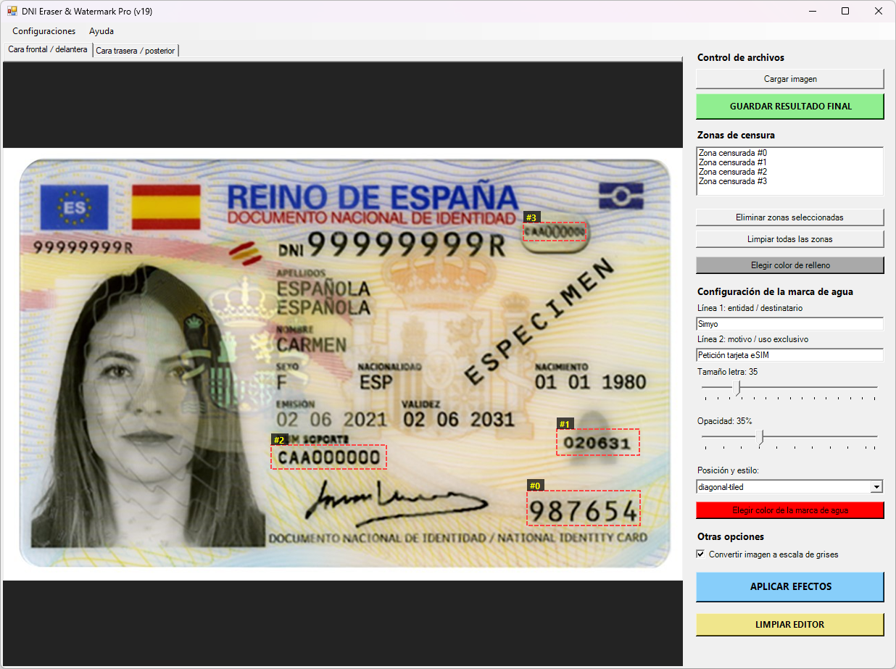
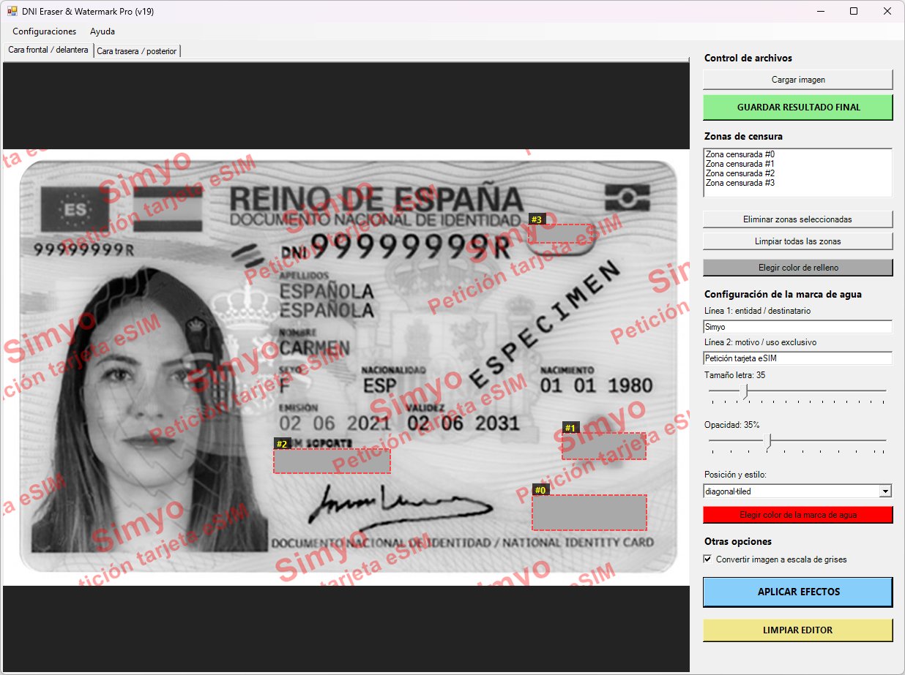

# DNI Eraser & Watermark Pro

## Introducción

Este programa surge como respuesta a una necesidad crítica de privacidad: la protección de documentos de identidad (como el DNI o pasaporte) al ser compartidos en entornos digitales.

Ante el riesgo latente de robo de identidad, fraudes financieros o uso indebido de datos personales, esta herramienta permite anonimizar zonas sensibles de una imagen (como números de soporte, firmas, fechas de nacimiento o fotografías) y aplicar marcas de agua personalizadas para evitar su reutilización no autorizada.

## ¿Cómo funciona?

El programa ofrece una interfaz gráfica intuitiva construida nativamente en Windows Forms mediante PowerShell.

El usuario puede cargar de forma independiente las caras frontal y trasera del documento, seleccionar de manera interactiva áreas mediante el arrastre del ratón para censurarlas (rellenándolas con un color sólido) y superponer textos personalizados en modo de mosaico diagonal oblicuo o estándar.

La herramienta realiza los cálculos dinámicos de redimensionamiento y escalado para asegurar que las modificaciones se apliquen con precisión matemática sobre los píxeles reales de la imagen, garantizando que el documento quede protegido antes de ser enviado a terceros.

## CHANGELOG DETALLADO

### 📌 Orígenes y migración inicial

* **v0 (Prototipo inicial):** Desarrollo conceptual realizado en Python por mi compañero de trabajo [John Doe](https://github.com/ryosoftware) y su herramienta de Inteligencia Artificial de referencia. Se trataba de una solución rápida a una idea loca surgida tras una conversación sobre la herramienta de IA utilizada.
* **v1 (Migración a PowerShell):** Intento de traducción del script a PowerShell usando la misma herramientas de IA. El resultado heredaba vicios de Python, contenía múltiples errores de sintaxis y el entorno gráfico no respondía correctamente en Windows.

### 📌 Fase de estabilidad y reescritura del motor gráfico

* **v2 (Reescritura de arquitectura):** Limpieza absoluta del código degradado de la v1. Se implementó una gestión correcta de los tipos de datos de `Windows.Forms` y `System.Drawing`. Se solucionaron los primeros problemas de UI al gestionar memoria gráfica GDI+.
* **v3 (El motor de capas real):** Separación del mapa de bits de visualización del mapa de bits de trabajo. Antes de esta versión, pintar una marca de agua o un recuadro destruía la imagen original por debajo. Se introdujo el concepto de renderizado dinámico por capas.
* **v4 (Coordenadas reales vs. coordenadas de pantalla):** Corrección de un error crítico: al dibujar zonas de censura en pantallas con escalado (DPI) o ventanas maximizadas, los rectángulos se desplazaban. Se añadieron las fórmulas de mapeo para transformar los clics de la pantalla en píxeles reales de la imagen.

### 📌 Evolución de la interfaz y persistencia

* **v5 (Estructura de pestañas "Cara Frontal / Trasera"):** Implementación de la interfaz de doble pestaña independiente. Se permitió trabajar el anverso y reverso del DNI simultáneamente en la memoria del programa sin cruzar los datos ni los rectángulos de censura.
* **v6 (Sistema anti-cuelgues por bloqueo de archivos):** Rediseño del flujo de carga de imágenes. Se eliminó el uso directo de `[System.Drawing.Image]::FromFile` (que dejaba el archivo bloqueado en el disco e impedía sobreescribirlo) y se migró a la lectura por flujo de datos (`MemoryStream`) liberando los recursos de inmediato.
* **v7 (Persistencia con archivos INI):** Incorporación de las funciones automáticas `Save-IniConfig` y `Load-IniConfig`. El programa empezó a recordar las imágenes seleccionadas, los colores y textos, la opacidad y el tamaño de la letra entre ejecuciones consecutivas.

### 📌 Control de zonas de censura y tratamiento de imagen

* **v8 (Gestión individual de rectángulos):** Modificación del listón lateral "Zonas de censura" (`ListBox`). El usuario pasa a poder ver el listado de zonas añadidas (`#0`, `#1`, etc.) en la imagen, permitiendo seleccionar una zona concreta de la lista y eliminarla con el botón "Eliminar zonas seleccionadas".
* **v9 (Tratamiento en escala de grises):** Inclusión de la matriz de color para conversión cromática. Se añadió un checkbox para transformar de manera opcional todo el documento final a escala de grises, unificando el contraste y dificultando la manipulación digital de las fotos editadas.
* **v10 (Filtros de entrada seguros):** Blindaje ante errores de usuario. Se añadieron validaciones que impiden que el programa falle o lance excepciones si se pulsa "Aplicar efectos" o "Guardar" sin haber cargado una imagen previamente.

### 📌 El desafío del patrón en mosaico (Diagonal-Tiled)

* **v11 (Introducción del mosaico oblicuo):** Mejora del modo `diagonal-tiled` en el combo de posiciones. Se programaron los bucles anidados `for` en los ejes X e Y junto con transformaciones de matriz (`RotateTransform`) para rellenar la imagen con las marcas de agua inclinadas a -25 grados.
* **v12 (Corrección del corte de margen):** Solución al problema de los cuadrantes vacíos. Al rotar la matriz gráfica, las esquinas superiores e izquierdas se quedaban sin marcas de agua. Se expandieron los límites de los bucles inicializándolos en valores negativos (`-$iw * 2`, `-$ih * 2`) para cubrir todo el lienzo.
* **v13 (Efecto ajedrezado - Offset alterno):** Mejora estética del patrón. Para evitar que las marcas de agua formaran columnas perfectamente verticales y aburridas, se añadió la lógica `$xOffsetRow = if ($rowCounter % 2 -eq 1) { [int]($hSpacing / 2) } else { 0 }`, desplazando las filas impares para crear un mosaico entrelazado profesional.
* **v14 (Ajuste fino de la densidad inicial):** Corrección dimensional. Se cambió el cálculo de separación basado en el tamaño fijo de la fuente por un cálculo dinámico basado en las dimensiones reales de la imagen, encontrando un espaciado horizontal amplio (`* 2.8`).

### 📌 Madurez y consolidación

* **v15 (El punto dulce de separación):** Optimización final de los factores de repetición del mosaico. Se detectó que el espaciado vertical de las líneas era demasiado estrecho y el horizontal de la v14 demasiado separado en ciertas dimensiones. Se recalculó la proporción matemática estableciendo el factor horizontal ideal en **1.4** y el vertical en **1.6**, logrando que el texto respire perfectamente y se visualicen varias marcas equilibradas por cada fila.
* **v16 (Soporte multiperfil independiente):** Evolución del archivo de configuración `.ini` para admitir múltiples perfiles simultáneos (`ImageComboX`). Cada documento mantiene ahora de forma aislada sus propias imágenes, coordenadas de censura y textos sin sobrescribir las sesiones anteriores.
* **v17 (Rediseño de interfaz y limpieza):** Reestructuración estética del menú "Recientes" para mostrar los nombres de los archivos cargados (p. ej., *frontal | trasera*) en lugar de códigos técnicos. Se añade el botón "LIMPIAR EDITOR" para resetear por completo la interfaz en un clic.
* **v18 (Metadatos contextuales y estabilidad):** Integración del texto de la **Línea 1** en el menú de "Recientes" para identificar las sesiones al vuelo (p. ej., *DNI | Movistar* o *DNI | Simyo*). Se corrigen las fugas de memoria en la escala de grises, garantizando un rendimiento fluido al aplicar efectos repetidamente.
* **v19 (Legibilidad del almacenamiento y autoría):** Optimización del formateador del archivo `.ini` para inyectar líneas en blanco divisorias entre bloques de configuración, facilitando su lectura manual. Actualización de metadatos internos en la sección informativa del software reflejando la fecha exacta de despliegue y los créditos de co-desarrollo.

## ⚠️ Exención de Responsabilidad (Disclaimer)

Este software se proporciona "tal cual" (as is), con fines estrictamente educativos y de protección personal de la privacidad.

El autor no se hace responsable bajo ninguna circunstancia de cualquier pérdida de datos, fallos en el sistema, ni del uso malintencionado, fraudulento o ilegal que se pueda realizar con las imágenes resultantes de esta aplicación.

### 🤖 Nota sobre el desarrollo asistido por IA

El código de esta herramienta ha sido generado y evolucionado con asistencia de Inteligencia Artificial (Gemini 3.5 Flash).

Si bien el script es **completamente funcional y autónomo** (habiendo superado pruebas rigurosas de fugas de memoria y estabilidad gráfica en entornos Windows nativos), es posible que ciertas estructuras o implementaciones de la interfaz WinForms no cuenten con el nivel de refactorización u optimización extrema propio de un desarrollo corporativo tradicional desde cero.

Se anima al usuario a revisar el código abierto ante cualquier duda de rendimiento específico.
